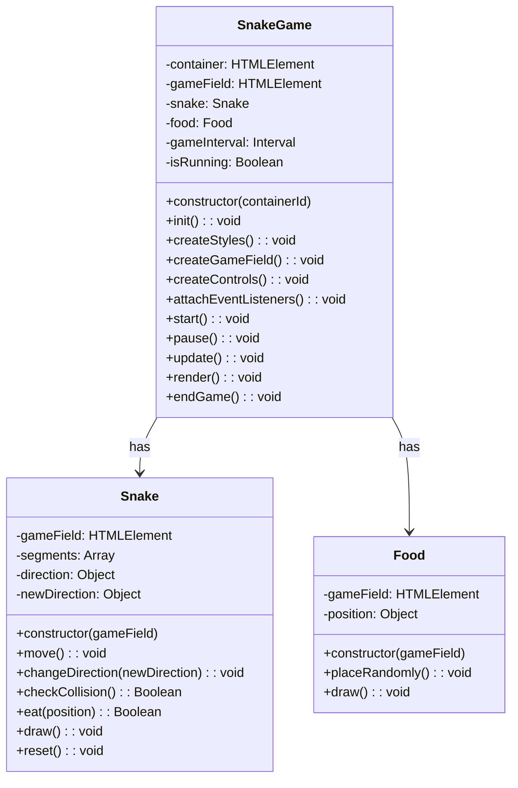
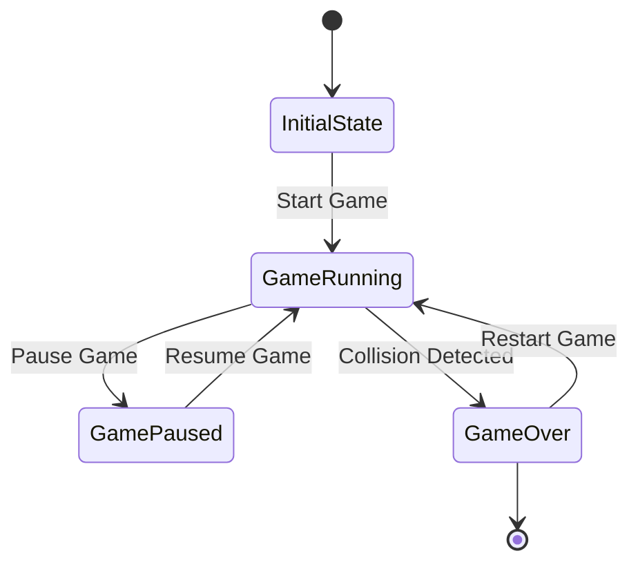
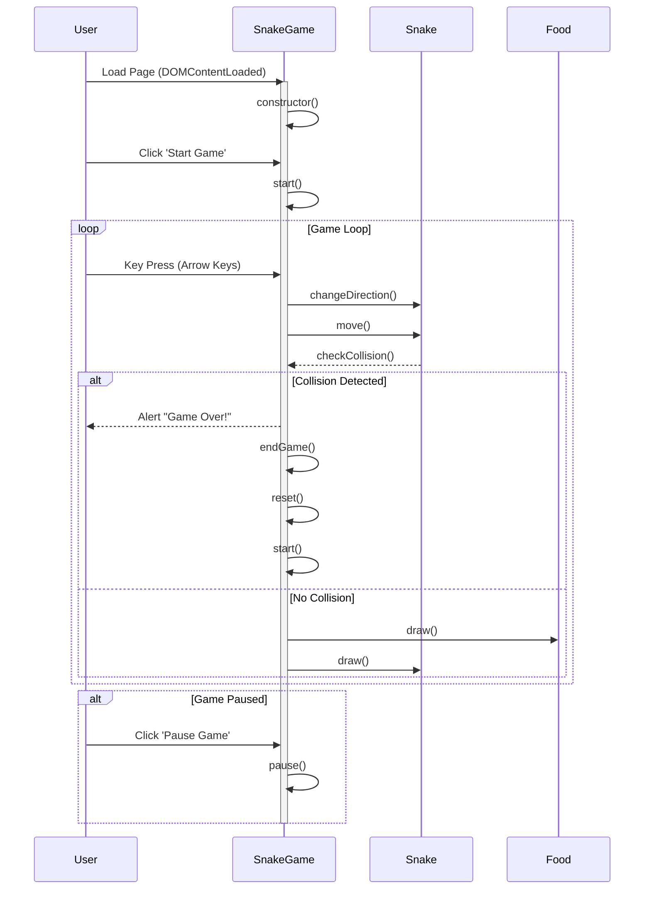
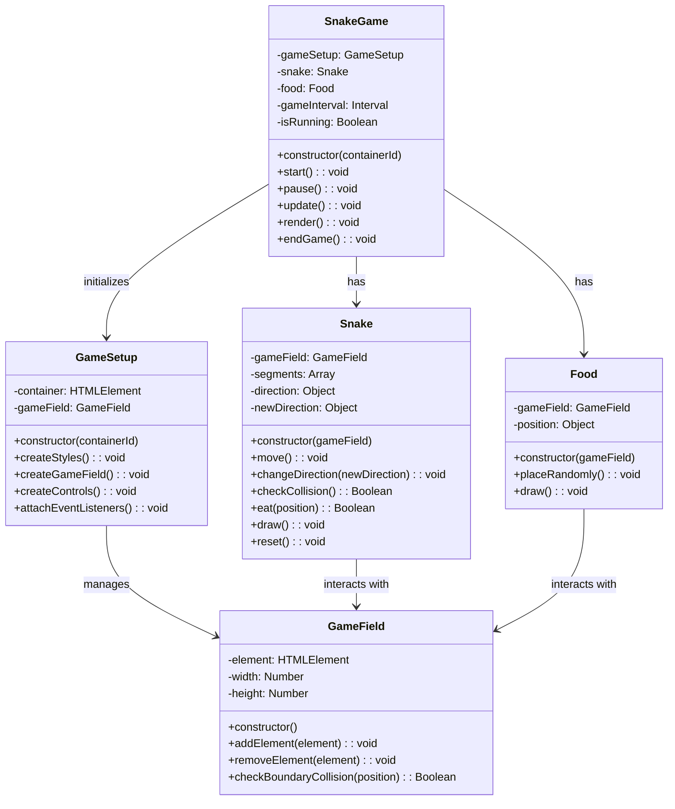
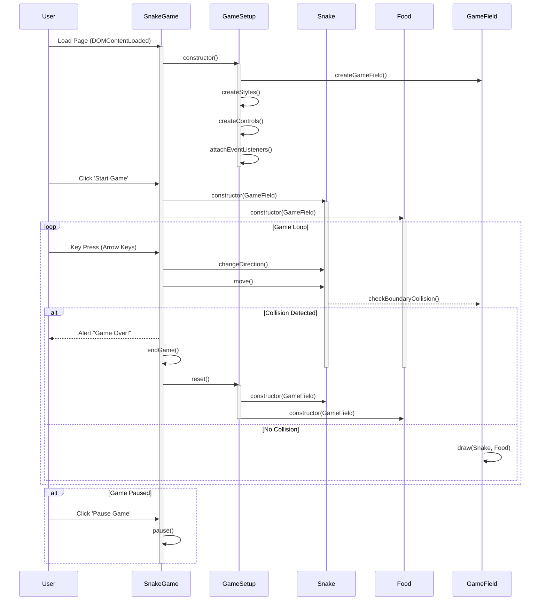

# Object Oriented Analysis and Design

## Class diagram

```mermaid
classDiagram
    class SnakeGame {
        -container: HTMLElement
        -gameField: HTMLElement
        -snake: Snake
        -food: Food
        -gameInterval: Interval
        -isRunning: Boolean
        +constructor(containerId)
        +init(): void
        +createStyles(): void
        +createGameField(): void
        +createControls(): void
        +attachEventListeners(): void
        +start(): void
        +pause(): void
        +update(): void
        +render(): void
        +endGame(): void
    }
    class Snake {
        -gameField: HTMLElement
        -segments: Array
        -direction: Object
        -newDirection: Object
        +constructor(gameField)
        +move(): void
        +changeDirection(newDirection): void
        +checkCollision(): Boolean
        +eat(position): Boolean
        +draw(): void
        +reset(): void
    }
    class Food {
        -gameField: HTMLElement
        -position: Object
        +constructor(gameField)
        +placeRandomly(): void
        +draw(): void
    }

    SnakeGame --> Snake : has
    SnakeGame --> Food : has

```

## State diagram

```mermaid
stateDiagram-v2
    [*] --> InitialState
    InitialState --> GameRunning : Start Game
    GameRunning --> GamePaused : Pause Game
    GamePaused --> GameRunning : Resume Game
    GameRunning --> GameOver : Collision Detected
    GameOver --> GameRunning : Restart Game
    GameOver --> [*]

```

## Sequence diagram

```mermaid
sequenceDiagram
    participant User
    participant SnakeGame
    participant Snake
    participant Food

    User->>SnakeGame: Load Page (DOMContentLoaded)
    activate SnakeGame
    SnakeGame->>SnakeGame: constructor()

    User->>SnakeGame: Click 'Start Game'
    SnakeGame->>SnakeGame: start()
    loop Game Loop
        User->>SnakeGame: Key Press (Arrow Keys)
        SnakeGame->>Snake: changeDirection()
        SnakeGame->>Snake: move()
        Snake-->>SnakeGame: checkCollision()
        alt Collision Detected
            SnakeGame-->>User: Alert "Game Over!"
            SnakeGame->>SnakeGame: endGame()
            SnakeGame->>SnakeGame: reset()
            SnakeGame->>SnakeGame: start()
        else No Collision
            SnakeGame->>Food: draw()
            SnakeGame->>Snake: draw()
        end
    end

    alt Game Paused
        User->>SnakeGame: Click 'Pause Game'
        SnakeGame->>SnakeGame: pause()
    end

    deactivate SnakeGame
```

# Refactoring

## Class diagram

```mermaid
classDiagram
    class SnakeGame {
        -gameSetup: GameSetup
        -snake: Snake
        -food: Food
        -gameInterval: Interval
        -isRunning: Boolean
        +constructor(containerId)
        +start(): void
        +pause(): void
        +update(): void
        +render(): void
        +endGame(): void
    }
    class GameSetup {
        -container: HTMLElement
        -gameField: GameField
        +constructor(containerId)
        +createStyles(): void
        +createGameField(): void
        +createControls(): void
        +attachEventListeners(): void
    }
    class Snake {
        -gameField: GameField
        -segments: Array
        -direction: Object
        -newDirection: Object
        +constructor(gameField)
        +move(): void
        +changeDirection(newDirection): void
        +checkCollision(): Boolean
        +eat(position): Boolean
        +draw(): void
        +reset(): void
    }
    class Food {
        -gameField: GameField
        -position: Object
        +constructor(gameField)
        +placeRandomly(): void
        +draw(): void
    }
    class GameField {
        -element: HTMLElement
        -width: Number
        -height: Number
        +constructor()
        +addElement(element): void
        +removeElement(element): void
        +checkBoundaryCollision(position): Boolean
    }

    SnakeGame --> GameSetup : initializes
    GameSetup --> GameField : manages
    SnakeGame --> Snake : has
    SnakeGame --> Food : has
    Snake --> GameField : interacts with
    Food --> GameField : interacts with
```

## Sequence Diagram

```mermaid
sequenceDiagram
    participant User
    participant SnakeGame
    participant GameSetup
    participant Snake
    participant Food
    participant GameField

    User->>SnakeGame: Load Page (DOMContentLoaded)
    activate SnakeGame
    SnakeGame->>GameSetup: constructor()
    activate GameSetup
    GameSetup->>GameField: createGameField()
    activate GameField
    GameSetup->>GameSetup: createStyles()
    GameSetup->>GameSetup: createControls()
    GameSetup->>GameSetup: attachEventListeners()
    deactivate GameSetup

    User->>SnakeGame: Click 'Start Game'
    SnakeGame->>Snake: constructor(GameField)
    activate Snake
    SnakeGame->>Food: constructor(GameField)
    activate Food
    loop Game Loop
        User->>SnakeGame: Key Press (Arrow Keys)
        SnakeGame->>Snake: changeDirection()
        SnakeGame->>Snake: move()
        Snake-->>GameField: checkBoundaryCollision()
        alt Collision Detected
            SnakeGame-->>User: Alert "Game Over!"
            SnakeGame->>SnakeGame: endGame()
            deactivate Snake
            deactivate Food
            SnakeGame->>GameSetup: reset()
            activate GameSetup
            GameSetup->>Snake: constructor(GameField)
            activate Snake
            GameSetup->>Food: constructor(GameField)
            activate Food
            deactivate GameSetup
        else No Collision
            GameField->>GameField: draw(Snake, Food)
        end
    end

    alt Game Paused
        User->>SnakeGame: Click 'Pause Game'
        SnakeGame->>SnakeGame: pause()
    end
    deactivate SnakeGame
```